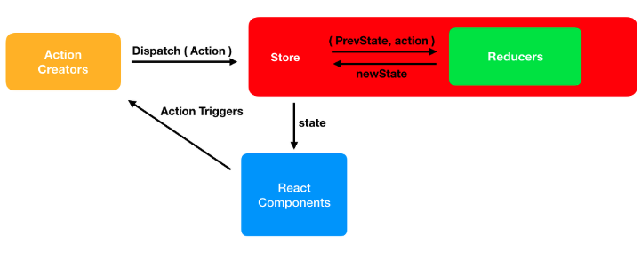
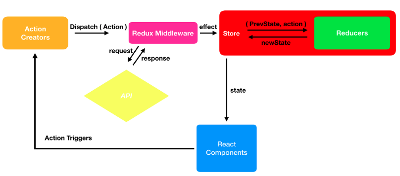

## Redux-Async Logic & Thunks
- redux thunks 이해하기

## 설치하기
- npm install @reduxjs/toolkit react-redux
- npm i date-fns // JS 날짜 라이브러리 중 다양한 형식을 제공
- npm i axios // Node.js와 브라우저를 위한 Promise API를 활용하는 HTTP 통신 라이브러리이다. 비동기로 HTTP 통신을 할 수 있으며 return을 promise 객체로 해주기 때문에 response 데이터를 다루기 쉽다.

## 미들웨어란?
- Redux에 임의의 기능을 넣어 확장하는 방법으로는 미들웨어를 추천한다.
- 액션을 디스패치 했을 때, 리듀서에서 이를 처리하기에 앞서 사전에 지정된 작업을 실행 할 수 있게 해준다. 액션과 디스패치의 중간자라고 볼 수 있다.
- 전달 받은 액션을 단순히 콘솔에 기록하거나, 전달받은 액션 정보를 기반으로 액션을 아예 취소하거나, 다른 종류의 액션을 추가하는 등 다양한 역할을 담당할 수 있다. 

## 미들웨어의 구조
```
const loggerMiddleware = store => next => action => {
  // 기본구조
}
export default loggerMiddleware
```
```
const loggerMiddleware = function loggerMiddleware(store){
  return function(next){
    return function(action){
      //기본 구조
    }
  }
}

export default loggerMiddleware;
```

- 함수를 반환하는 함수를 반환하는 함수이다. 파라미터로 받아오는 store는 리덕스 스토어 인스턴스, action은 디스패치된 액션을 가리킨다. 
- 미들웨어에서 사용되는 새로운 파라미터는 next 인데, 이는 함수형태이며 store.dispatch 와 비슷한 역할을 한다. 차이점은 next(action)을 통해 다음 처리해야할 미들 웨어에게 액션을 넘겨주고, 만약 그 다음 미들웨어가 없다면 리듀서에게 액션을 넘겨준다. 


## redux 미들웨어가 필요한 이유는?
- 기존의 리덕스는 액션이 발생하게 되면 디스패치를 통해 스토어에게 상태 변화의 필요성을 알리게된다. 
- 하지만, 디스패치된 액션을 스토어로 전달하기 전에 처리하고 싶은 작업이 있을 수 있다. 
- 단순히 어떤 액션이 발생했는지 로그를 남길 수도 있고, 액션을 취소하거나 또 다른 액션을 발생할 수 도있다. 
- 리덕스의 흐름은 대략 액션 객체가 생성되고, 디스패치가 액션 발생을 스토어에 알리면, 리듀서는 정해진 로직에 의해 액션을 처리한 후 새로운 상태값을 반환하는 과정이다. 
- 만약 시간을 딜레이 시켜서 동작을 하게 한다던지, 외부 데이터를 요청하여 그에 따른 응답을 화면에 보여주어야 한다면 어떻게 처리해야하나?
- 이럴때, 비동기 작업을 처리하기 위해서 리덕스 미들웨어를 사용한다. 
- 리덕스 미들웨어를 통해 비동기 작업을 처리할 때 사용하는 미들웨어는 대표적으로 redux-thunk, redux-saga 등이 있다. 

### 기존 리덕스의 흐름


### 비동기 작업을 위해 미들웨어가 추가된 리덕스의 흐름



## redux-thunk란
- 리덕스를 사용하는 어플리케이션에서 비동기 작업을 처리 할 때 가장 기본적인 방법으로는 redux-thunk 라는 미들웨어를 사용하는 것이다. 

## thunk란?
- 리덕스 미들웨어가 그 함수를 전달 받아 store의 dispatch와 getState를 파라미터로 넣어 호출하는 것.
- 예시 thunk 함수

```
        const sampleThunk = () => (dispatch, getState) => {
        	// 현재 상태 참조 가능
        	// 새 액션 디스패치 가능
        }
```

## immer.js
- immer라는 라이브러리를 사용하면, 우리가 상태를 업데이트 할 때, 불변성을 신경쓰지 않으면서 업데이트 해주면 immer가 불변성 관리를 대신 해준다. 

## Object.entries
- ES8에 도입된 Object.entries는 객체 자식의 열거 가능한 프로퍼티 키와 값의 쌍의 배열을 배열에 담아 반화한다. 

```
const person = {
   name:'lee',
   age: 30
   
}

console.log(Object.entries(person))

Object.entries(person).forEach(([key,value]) => console.log(key, value))

```