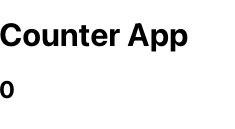

## 리덕스 기초 - counter 앱으로 익히기 

### 설치
- npm i react-redux

### 1단계

```
src
 ┣ store
 ┃ ┗ store.js
```
- store 폴더 안 store.js 파일에서 createStore를 생성한다. 

```
import {createStore} from 'redux'

const reducerFn = (state={ counter: 0 }, action) => {
  // 초기 state를 설정해 놓는다. 

  // state의 값을 변경할 수 있도록 해야함

}

const store = createStore(reducerFn)
export default store

```


### 2단계
- store.js파일에서 store의 값을 생성 한 후 index.js 파일안에 Provider 컴포넌트를 감싼다.
- 리액트 리덕스 앱의 모든 구성요소는 store에서 연결된다. 
- <Provider>는 전체앱의 구성요소 트리의 최상위 수준에서 렌더링 한다.

```
import React from 'react';
import ReactDOM from 'react-dom/client';
import './index.css';
import App from './App';
<span style="color:red">import {Provider} from 'react-redux'</span>
// Provider 구성요소는 store를 리덕스 저장소에 액세스해야하는 모든 중첩된 구성 요소에 전달한다. 
import store from './store/store';

const root = ReactDOM.createRoot(document.getElementById('root'));

root.render(
  <Provider store={store}>
  <React.StrictMode>
    <App />
  </React.StrictMode>
  </Provider>
);

```

### 3단계
- App.js 에서 state를 사용하기 위해서 useSeletor를 import 한다. 
- useSelector는 redux store에 저장된 state의 데이터를 실행 시켜 값을 반환할 수 있다. 값을 불러드려 사용할 수 있도록 해준다. 

- 다시 store.js 파일로 돌아가 state의 return 값을 반환해주고,
```
import {createStore} from 'redux'
// 밑줄 그어진 것은 그냥 무시하면됨.. 오류 없음

const reducerFn = (state={ counter: 0 }, action) => {
  return state;
  
}

const store = createStore(reducerFn)
export default store
```


- App.js의 파일로 돌아와 다음과 같이 state를 반환해주는 useSelector hook을 import 한다. 

```
import {useSelector} from 'react-redux'
// useSelector는 redux store에 저장된 state의 데이터를 실행 시켜 값을 반환할 수 있다. 값을 불러드려 사용할 수 있도록 해준다. 

function App() {
  const counter = useSelector((state) => state.counter)
  // useSelector 함수를 이용하여 store의 초기 state.counter를 정보를 받아온다. 

  return (
    <div>
      <h1>Counter App </h1>
      <h2>{counter}</h2>
    </div>
  );
}

export default App;
```



### 4단계
- 위와 같이 state의 값이 잘 반환되는 것을 확인 후 아래와 같이 counter의 값을 변화 시키는 onClick 버튼을 만든다. 

```
import {useSelector, useDispatch} from 'react-redux'
// useSelector는 redux store에 저장된 state의 데이터를 실행 시켜 값을 반환할 수 있다. 값을 불러드려 사용할 수 있도록 해준다. 

// useDispatch는 action을 통해 실행 시킬 수 있다. action이 변경할 때 새 state를 넣어줘야 reducer에서 값을 넘겨준다. 

function App() {
  const counter = useSelector((state) => state.counter)
  // useSelector 함수를 이용하여 store의 초기 state.counter를 정보를 받아온다. 

  const dispatch = useDispatch()
  // dispatch로 action값을 reducer로 전달한다. 
  const increment = () => {
    dispatch({type:'INC'})
  }
  const decrement = () => {
    dispatch({type:'DEC'})
  }
  
  const addBy = () => {
    // payload안에 전달하고자 하는 state의 값을 넣는다. 
    dispatch({type:'ADD', payload: 10})
  }


  return (
    <div>
      <h1>Counter App </h1>
      <h2>{counter}</h2>

      <button onClick={increment}>+</button>
      <button onClick={decrement}>-</button>
      <button onClick={addBy}>Add By 10</button>
    </div>
  );
}

export default App;


```

- store의 함수의 조건을 입력한다. 

```
import {createStore} from 'redux'
// 밑줄 그어진 것은 그냥 무시하면됨.. 오류 없음

const reducerFn = (state={ counter: 0 }, action) => {

  // useDispatch로 받아온 action 값이 INC이면,다음과 같이 state의 값을 반환한다. 
  if(action.type === 'INC') {
    return {counter:state.counter+1}
  }
  
  if(action.type === 'DEC') {
    return {counter:state.counter-1}
  }

  if(action.type === 'ADD') {
    return {counter: state.counter + action.payload}
  }

  return state;

}

const store = createStore(reducerFn)
export default store
```